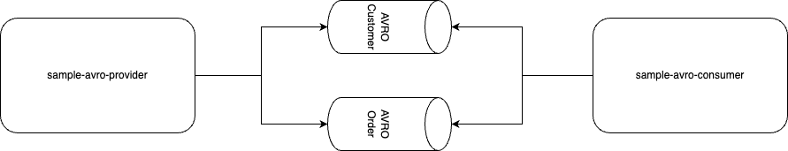

# Pact Avro Example

1. Run the consumer tests `./gradlew test --tests "*Consumer*"`  
This will generate the consumer pact file at `/build/pacts/sample-avro-consumer-sample-avro-provider.json`  

2. Run the provider tests `./gradlew test --tests "*Provider*"`

## Result:
### Expected
All tests pass

### Actual
`body: $ Plugin Avro Schema configuration item with key '65304033840260accc36fc52520ed0ff' is required`

### Investigation
When you inspect the consumer pact file, the `metadata.plugins.plugins` block only has 1 key, for one of the 2 avro schemas.  
Updating the file **manually**, and putting the avro schema in for the Customer schema fixed it.